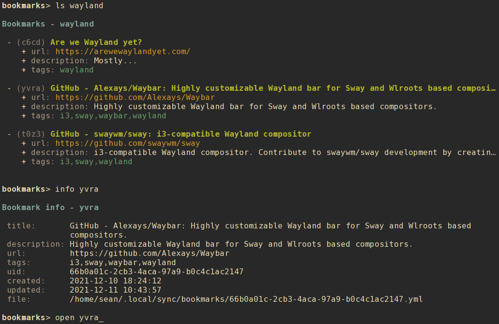

# nrrdmark

A terminal-based bookmark management program with advanced search options, formatted output, and bookmark data stored in local text files.

## Contents

- [Getting nrrdmark](#getting-nrrdmark)
    - [Downloading](#downloading)
    - [Python dependencies](#python-dependencies)
    - [Installing](#installing)
        - [Setuptools](#setuptools)
        - [Make](#make)
- [Using nrrdmark](#using-nrrdmark)
    - [Basic usage](#basic-usage)
    - [Command-line usage](#command-line-usage)
        - [Listing bookmarks and tags](#listing-bookmarks-and-tags)
        - [Display info about a bookmark](#display-info-about-a-bookmark)
        - [Opening a bookmark](#opening-a-bookmark)
        - [Editing a bookmark](#editing-a-bookmark)
        - [Creating a new bookmark](#creating-a-new-bookmark)
        - [Modifying a bookmark](#modifying-a-bookmark)
        - [Clearing values from a bookmark](#clearing-values-from-a-bookmark)
        - [Deleting a bookmark](#deleting-a-bookmark)
        - [Archiving a bookmark](#archiving-a-bookmark)
        - [Search and query](#search-and-query)
        - [Exclusion](#exclusion)
        - [Search examples](#search-examples)
        - [Paging](#paging)
    - [Interactive shell](#interactive-shell)
        - [Interactive modify](#interactive-modify)
        - [A note about refresh](#a-note-about-refresh)
    - [Configuration](#configuration)
        - [Default configuration](#default-configuration)
        - [Alternate configuration](#alternate-configuration)
        - [Editing configuration](#editing-configuration)
        - [Main configuration options](#main-configuration-options)
        - [Color configuration options](#color-configuration-options)
    - [Bookmark data](#bookmark-data)
        - [Bookmark data fields](#bookmark-data-fields)
            - [Managed fields](#managed-fields)
            - [User-modified fields](#user-modified-fields)

## Getting `nrrdmark`
### Downloading
To download `nrrdmark` simply clone this repository:

    git clone https://github.com/sdoconnell/nrrdmark.git

### Python dependencies
`nrrdmark` requires Python 3.8+ and the following Python 3 libraries to be available:

- `pyyaml`
- `rich`
- `watchdog`
- `dateutil`
- `tzlocal`
- `beautifulsoup4`
- `requests`  

You may install these dependencies from your Linux distribution's repos (if available) or via `pip` using the `requirements.txt` file provided in this repository:

    pip install -r requirements.txt

### Installing
You may install the application one of two ways: via `setuptools`, or via `make`. Installing via `make` will also install the manpage for `nrrdmark(1)` and will copy the `README.md` file into your system documentation directory.

#### Setuptools
Run the `setup.py` script to install system-wide (likely requires `su` or `sudo`):

    sudo python3 setup.py install

Alternatively, you may install the package to your `$HOME` directory.

    python3 setup.py install --user

#### Make
Use `make` to install the application system-wide (likely requires `su` or `sudo`):

    sudo make install

There is also an `uninstall` operation available:

    sudo make uninstall

## Using `nrrdmark`
### Basic usage
`nrrdmark` is a terminal-based application that can be run in either of two modes: command-line or interactive shell.

    nrrdmark -h
    usage: nrrdmark [-h] [-c <file>] for more help: nrrdmark <command> -h ...

    Terminal-based bookmarks management for nerds.

    commands:
      (for more help: nrrdmark <command> -h)
        archive             archive a bookmark
        delete (rm)         delete a bookmark file
        edit                edit a bookmark file (uses $EDITOR)
        info                show info about a bookmark
        list (ls)           list bookmarks
        modify (mod)        modify a bookmark
        new                 create a new bookmark
        open                open a bookmark
        query               search bookmarks with structured text output
        search              search bookmarks
        shell               interactive shell
        unset               clear a field from a specified bookmark
        version             show version info

    optional arguments:
      -h, --help            show this help message and exit
      -c <file>, --config <file>
                            config file

### Command-line usage
#### Listing bookmarks and tags
There are several options for listing your bookmarks:

- `list all` (or `lsa`) : list all of your bookmarks.
- `list tags` (or `lst`) : list all tags and the number of bookmarks with each tag.
- `list <tag>` : list all bookmarks tagged with \<tag\>.
- `list <alias>` : list the specific bookmark for \<alias\>.

Entries are listed in the following tabular format:

        - (alias) title
          + url: url
          + description: description
          + tags: tags

- **Line 1**: the bookmark alias and title.
- **Line 2**: the bookmark url.
- **Line 3**: the bookmark description.
- **Line 4**: any tags assigned to the bookmark.

#### Display info about a bookmark
Use the `info` subcommand to see the full metadata for a bookmark.

    nrrdmark info 5kzb

#### Opening a bookmark
Use the `open` subcommand to open the bookmark in your browser (either the command defined by the `browser_cmd` configuration option, or the detected system default browser).

    nrrdmark open 5kzb

#### Editing a bookmark
Use the `edit` subcommand to open the bookmark file in your preferred editor. Use care in editing the bookmark file directly. Malformed file structure may result in `nrrdmark` being unable to properly parse the file.

    nrrdmark edit 5kzb

#### Creating a new bookmark
Use the `new` subcommand to create a new bookmark. This option will create a new bookmark file in your `nrrdmark` data directory (`$XDG_DATA_HOME/nrrdmark` or `$HOME/.local/share/nrrdmark` by default). See `nrrdmark new -h` for all available options and their command syntax.

    nrrdmark new <url> [options]

If `--title` and/or `--description` are not provided when creating a new bookmark, `nrrdmark` will attempt to connect to the provided URL and determine title and description from the webpage content.

#### Modifying a bookmark
Bookmark metadata may be changed using the `modify` command. See `nrrdmark modify -h` for all available options and their command syntax.

    nrrdmark modify <alias> [options]

#### Clearing values from a bookmark
The following fields of an bookmark can be cleared (set to `null`) using the `unset` command:
- `tags`
- `description`

The command syntax is:

    nrrdmark unset <alias> <field>

#### Deleting a bookmark
Use the `delete` subcommand to delete a bookmark identified by the record's `alias`. Confirmation will be required for this operation unless the `--force` option is also used.

    nrrdmark delete <alias> [--force]

#### Archiving a bookmark
Use the `archive` subcommand to move the bookmark file to the subdirectory `archive` in the the bookmarks data directory. Confirmation will be required for this operation unless the `--force` option is also used.

Archived bookmarks will no longer appear in lists of bookmarks. This can be useful for retaining old bookmarks without resulting in endlessly growing bookmark lists. To review archived bookmarks, create an alterate config file with a `data_dir` pointing to the archive folder, and an alias such as:

    alias nrrdmark-archive="nrrdmark -c $HOME/.config/nrrdmark/config.archive"

#### Search and query
There are two command-line methods for filtering the presented list of bookmarks: `search` and `query`. These two similar-sounding functions perform very different roles.

Search results are output in the same tabular, human-readable format as that of `list`. Query results are presented in the form of tab-delimited text (by default) or JSON (if using the `-j` or `--json` option) and are primarily intended for use by other programs that are able to consume structured text output.

`search` and `query` use the same filter syntax. The most basic form of filtering is to simply search for a keyword or string in the bookmark title, description, and/or url:

    nrrdmark search <search_term>

**NOTE:** search terms are case-insensitive.

If the search term is present in either the bookmark `title`, `description`, or `url`, the bookmark will be displayed.

Optionally, a search type may be specified. The search type may be one of `uid`, `alias`, `description`, `tags`, `title`, or `url`. If an invalid search type is provided, the search will ignore it. To specify a search type, use the format:

    nrrdmark search [search_type=]<search_term>

You may combine search types in a comma-delimited structure. All search criteria must be met to return a result.

The tags search type may also use the optional `+` operator to search for more than one tag. Any matched tag will return a result.

The special search term `any` can be used to match all bookmarks, but is only useful in combination with an exclusion to match all records except those excluded.

#### Exclusion
In addition to the search term, an exclusion term may be provided. Any match in the exclusion term will negate a match in the search term. An exclusion term is formatted in the same manner as the search term, must follow the search term, and must be denoted using the `%` operator:

    nrrdmark search [search_type=]<search_term>%[exclusion_type=]<exclusion_term>

#### Search examples
Search for any bookmark with "projectx" in the title, description, or URL:

    nrrdmark search projectx

Search for any bookmark with "projectx" specifically in the title:

    nrrdmark search title=projectx

Search for all bookmarks tagged "development" or "testing" with a title containing "projectx", except for those that have 'domain.tld' in the URL:

    nrrdmark search title=projectx,tags=development+testing%url=domain.tld

#### Query and limit
The query function uses the same syntax as search but will output information in a form that may be read by other programs. The standard fields returned by query for tab-delimited output are:

    - uid (string)
    - alias (string)
    - title (string)
    - url (string)
    - tags (list)

List fields are returned in standard Python format: ['item 1', 'item 2', ...]. Empty lists are returned as []. Empty string fields will appear as multiple tabs.

JSON output returns all fields for a record, including fields not provided in tab-delimited output.

The query function may also use the `--limit` (`-l`) option. This is a comma-separated list of fields to return. The `--limit` option does not have an effect on JSON output.

#### Paging
Output from `list`, `search`, and `info` can get long and run past your terminal buffer. You may use the `-p` or `--page` option in conjunction with `search`, `list`, or `info` to page output.

### Interactive shell
`nrrdmark` also features an interactive mode, enabled by `shell`. This mode offers commands similar to the command-line options, but in a persistent shell-like environment.

Most commands are similar to their command-line argument analogs:

- `list <view>` (or `lsa`, `lst`)
- `config`
- `new`
- `open <alias>`
- `archive <alias>`, confirmation is always required (no `--force`).
- `info <alias>`
- `edit <alias>`
- `modify <alias>`
- `delete <alias>` (or `rm <alias>`), confirmation is always required (no `--force`).
- `search <term>`
- `help [command]`

**NOTE**: `query` does not have a shell command, as there is no obvious use case for that command in interactive mode.

A couple of additional shell-specific commands exist:
- `clear` : clear the shell output.
- `refresh` : re-read the bookmark files on disk if edits were made outside of `nrrdmark`.

#### Interactive modify
To modify a bookmark in interactive mode, use the command `modify <alias>` to enter a subshell for modifying the record. When done making changes, you may leave the subshell with the command `done`. For available commands, use the `help` command while in the modify subshell. The syntax is similar to that for the CLI modify command, with the exception that it is not necessary to specify an alias with the subcommands (due to the subshell context being a specific bookmark). For example:

CLI usage:

    nrrdmark modify aw4d --tags +development,testing

Interactive usage:

    bookmarks> modify aw4d
    modify (aw4d)> tags +development,testing
    modify (aw4d)> done
    bookmarks>

All changes made while in the `modify` subshell take effect (and are saved) immediately.

#### A note about `refresh`
When using `new`, `modify`, `edit`, or `delete` it is **not** necessary to perform a manual `refresh` afterward. This is done automatically when the previous operation is completed. In general, a manual `refresh` should not be needed but the functionality is included to cover edge cases.
 
### Configuration
#### Default configuration
By default, `nrrdmark` reads its configuration from a config file located at either `$XDG_CONFIG_HOME/nrrdmark/config` or `$HOME/.config/nrrdmark/config`. If the default configuration file does not exist, `nrrdmark` will attempt to create the file with default options specified.

#### Alternate configuration
Instead of the default configuration file, an alternate config file may be selected by using the command-line argument `-c <file>`.

#### Editing configuration
For convenience, the `config` command will open the config file in your `$EDITOR`. In interactive shell mode, the configuration will be reloaded after editing and the new settings applied immediately.

#### Main configuration options
The following options are available under the `[main]` header of the configuration file:

- `data_dir` : (str) the location of bookmark files.
- `browser_cmd` : (str) the command to use to open a bookmark (optional).
- `always_new_window` : (str) always try to open the bookmark in a new browser window (browser support varies). `browser_cmd` overrides this option.

#### Color configuration options
`nrrdmark` supports customization of colors and bold in output. The following options are available under the `[colors]` header of the configuration file:

- `disable_colors` : (bool) turn off color output.
- `disable_bold` : (bool) turn off bold font output.
- `color_pager` : (bool) turn on or off color output in the pager (disabled by default, enable if your pager supports color output).

The following options under the `[colors]` header can be used to define a custom color scheme. Specify one of the standard terminal color names such as `red`, `black`, `bright_yellow`, etc.

- `table_title` : (str) the color for the table title.
- `bookmark_title` : (str) the color for the bookmark title.
- `description` : (str) the color for bookmark description text.
- `url` : (str) the color for url text.
- `alias` : (str) the color for alias text.
- `tags` : (str) the color for tags text.
- `label` : (str) the color for field labels.

**NOTE**: `url` color may be overridden by your terminal emulator's in-built URL highlighting. If you find that the URL color does not match your configuration settings, check your terminal emulator settings.

### Bookmark data
Bookmark files are stored in the `data_dir` defined by the `nrrdmark` configuration file. The default location is `$XDG_DATA_HOME/nrrdmark` or `$HOME/.local/share/nrrdmark`. Each bookmark is stored in its own text file and serialized in [YAML](https://yaml.org/) format. For more information about editing YAML files, see the [YAML spec](https://yaml.org/spec/1.2/spec.html).

#### Bookmark data fields
In theory, any arbitrary data may be stored in bookmark files. However, `nrrdmark` will only parse and display the below data set.

##### Managed fields
The following fields are managed by `nrrdmark` and should not be edited directly.

- `uid` : an [RFC 4122](https://datatracker.ietf.org/doc/html/rfc4122) UUID, randomly generated when the record is created via `new`.
- `created` : Datetime timestamp. Generated when the record is created via `new`.
- `updated` : Datetime timestamp. Generated when the record is created via `new` and updated when the record is edited via `modify`.

##### User-modified fields
The following fields may be modified by the user.

- `alias` : A randomly-generated 4-digit alias for the bookmark. This may be changed if preferred. Use a short string without spaces. Aliases are case-insensitive.
- `tags` : Tags assigned to the bookmark. (list)
- `title` : The title of the bookmark.
- `description` : The description of the bookmark.
- `url` : The bookmark URL.

