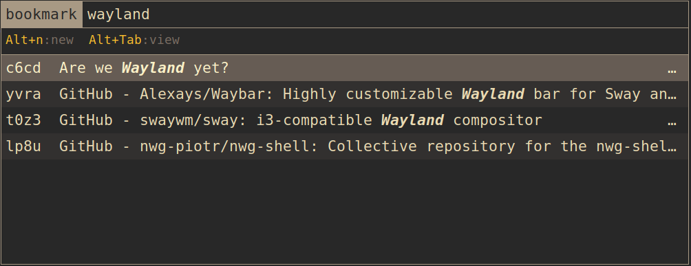

# Add-ons and demos

These are add-on and demonstration scripts.

## nm_rofi.sh
This is a [rofi](https://github.com/davatorium/rofi) interface script to nrrdmark, derived heavily from the work done by Rasmus Steinke on [buku_run](https://github.com/carnager/buku_run). This script is for demonstration purposes only, and is not a supported component of the `nrrdmark` application.

